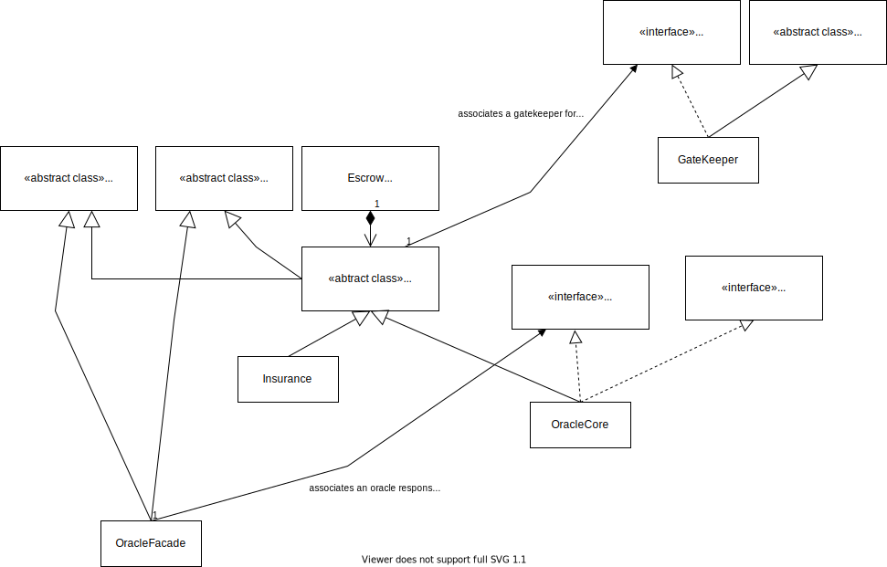
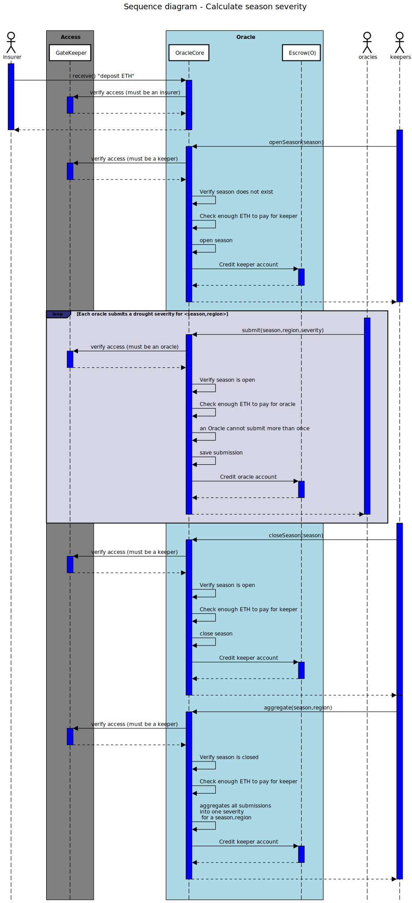
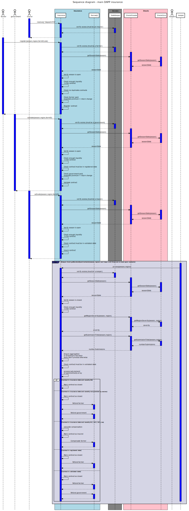

# Project idea

## DAPP crop insurance

Crop insurance is an insurance purchased by farmers to protect against the loss of their crops due to natural disasters (drought, flood, hail..) [Ref](https://en.wikipedia.org/wiki/Crop_insurance).

In this project, we are going to build a simplified DAPP where the insurance policy is materialized in a smart contract.  For the sake of simplicity , we are going to take many hypotesis

## Hypothesis

- The insurance premium is paid for every agricultural cycle. For simplification, an agricultural cycle(aka season) is simple a year (e.g.: 2021)
- DAPP used to insure 1 commodity : Wheat
- DAPP used to insure 1 kind of disaster: Drought
- We wonsider There are several regions. Hence, a Drought severity will be calculated for a combination of season and region. For flexibility, Region will be provided as bytes32 to our smart contracts (which can be calculated as keccak256 hash for any input data)
- a farmer can have several farms in different regions. Hence , every farm is identified by a farmID. An insurance contract is uniquely identified the following combination:
  - Season
  - Region
  - FarmID
- We will use the following [Classification](https://droughtmonitor.unl.edu/About/AbouttheData/DroughtClassification.aspx). Insurance is released only if the severity is D1(Moderate Drought) , D2( Severe drought) , D3(Extreme drought) or D4(Exceptional drought). Drought severity for a specific region and a specific agricultural cycle is regularly provided by Oracles. When a season is open, oracles are elligible to submit a severity for each region. an Oracle cannot submit anymore if a season is closed
- Every oracle is paid 0.5 ETH for its work
- Once a season is closed, By region Severity is aggregated as follow:
  - If number of submissions which are D1 or D0 < 50% of all submissions --> Severity is the one which got the maximum number of submissions (D1 or D0). In case there is an equality then Severity = D1
  - Else, Severity is the one which got the maximum number of submissions (D4 or D3 or D2). In case there is an equality, the worst Severity wins (e.g.: if nD4 = nD3 then Severity = D4)
  - Examples:
    - [D3,D4,D2,D2,D3,D4,D1,D1,D1,D1] ==> 6/10 have D2,D3,D4 ==> equality between nD4,nD2, nD3 so answer aggregate should be D4
    - [D0,D1,D1,D0,D1,D3,D2,D2,D3,D4] ==> 5/10 have D2,D3,D4 ==> equality between nD3, nD2 so aggregate should be D3
    - [D0,D0,D1,D0,D1,D1,D2,D2,D3,D4] ==> 6/10 have D0,D1 ==> equality between nD1, nD0 so aggregate should be D1
- Aggregation of severity can only be calculated once the season is closed. Aggregation of severity for a specific season,region is triggered by keepers
- Keepers are pad 0.1 ETH for their work
- As yield data is not available, insurance company is not able to vet and underwrite wheat accurately. The insurance company asks a premium price of 0.15 ETH/HA (1 hectare = 2,47105 Acres). How the premium was calculated is out of scope of this project
- KYC of farmers is out of scope
- Governments will participate 50 % of the premium. In fact, Governments are incentivized to transfer risk of natural disasters to private sector (insurance company)
- Compensation is calculated as follow:
  - D0 doesn't give any compensation 
  - D1 gives 0.5 times the premium
  - D2 gives 1 times the premium
  - D3 gives 2 times the premium
  - D4 gives 2.5 times the premium
- Compensation calculation is triggered by keepers offchain. Keepers are paid 0.01 ETH each time a compensation is calculated
- Insurance company has to stake enough ETH for every agricultural cycle in order to ensure that there will be always enough balance to compensate farmers in case there are drought. If there are not enough ETH staked in the contract then onboarding of new farmers are refused 
- Smart contract locks staked ETH and insurance company can takes back its ETH only if there is enough liquidity to compensate all farmers
- Farmers are able to interact with the DAPP and protect their identity (private key). In reality , identity protection seems very unlikely as it might be very technical for the farmer so we can foresee several modes of payment in the DAPP (e.g.: ETH or Fiat through wire transfer): In case payment of premium is in Fiat then the insurance in case of disaster will be released via wire transfer. For simplicity sake, I will focus on ETH payment and maybe dig into the latter case if I've got enough time

## Actors & roles
- Farmers: register an insurance contract (season , region , farmID) , providing all the needed data (farm data) and pays 50% of the premium which is calculated by the smart contract
- Government employees (from agriculture department): Approves an insurance contract registration and pays the 50% remaining premium
- Insurance: final approval of insurance contract
- Oracles: Regularly update Drought severity for every region
- Keepers: their role is to trigger some functions under certain conditions (e.g.: declare a season as open, close it , trigger aggregation of oracles answers, trigger calculation of compensation..)

## Objectives
Insurance policies still rely on government and insurance company collaboration , however crop insurance DAPPs can have the following advantages:
- Insurance policy is defined within the smart contract. Hence there are no exceptions
- Insurance company cannot default as ETH are staked within the smart contract. Hence, once a farmer 
- Full transparency. Both  a government employee and an insurance company admin validate information provided by the farmer during his/her onboarding and approval transaction is perform within the blockchain 

# Architecture
## Class diagram

## Sequence diagram

### Severity calculation

### Insurance

