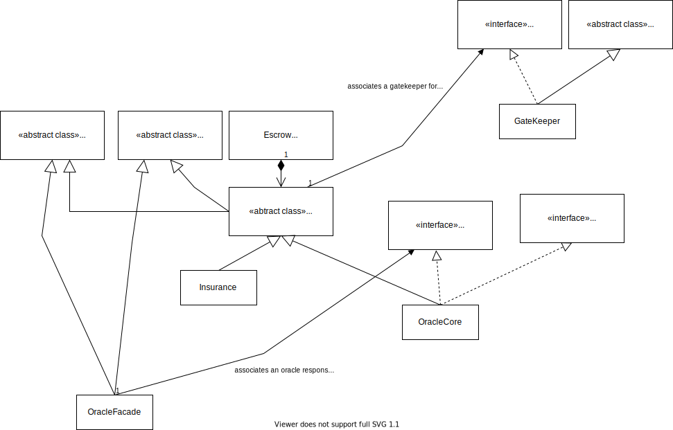
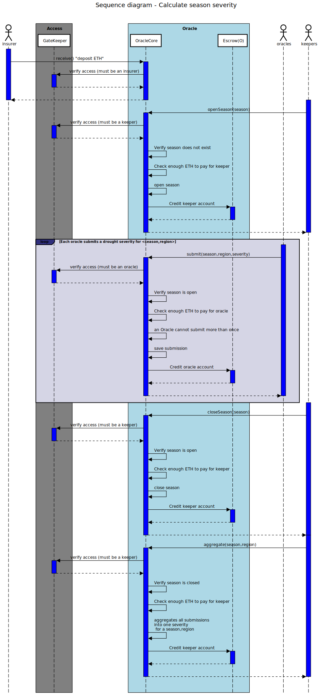

# Architecture
## Class diagram

### Explanation


Isurance DAPP is built by 3 main components:
- Insurance: this where registration of insurance contracts , paymnent of premium and paiment of compensation happen
- OracleCore: that's where seasons are opened and closed by keepers. When the season is open, oracles start submitting Severity by region
- OracleFacade: allow an admnistrator to specify the address of OracleCore. Hence, it allows to deploy new versions of OracleCore without impacting consumers. Infact Insurance, calls OracleFacade (cfr. sequence diagram below)

### Chosen design patterns

#### Inheritance

Inheritance of contracts is used heavily in this project (cfr. class diagram). Either for inheriting *Openzeppelin contracts* Or inherting `Common.sol` which is an abstract contract inherited by `Insurance.sol` and `OracleCore.sol` and which provides some common functionalities like checking the access control(via calls to `GateKeeper` functions) , depositing ETH into an escrow account...ETc

#### Interfaces and ERC165

Inrfaces are used whenever we foresee to have several implementations of the same type and dynamically change the reference to the implementation in client contracts. For instance:
- `IGateKeeper.sol` is imported in `Common.sol` , hence we can change the reference of `GateKeeper`. This is interesting for upgradibility
- `IOracle.sol` is imported in `OracleFacade.sol` , hence we can change the reference of `Oracle` without impacting `Insurance` (which is a client to `OracleFacade`)

Whenever an interface is imported, we make use of [ERC165](https://medium.com/@chiqing/ethereum-standard-erc165-explained-63b54ca0d273). Basically , whenever the reference to the implementation is dynamically changed, we call a function 

```
function supportsInterface(bytes4 interfaceID) 
    external view returns (bool);
```
to make sure the new reference supports the right interface


#### Library 

[Openzeppelin Library](https://docs.openzeppelin.com/contracts/4.x/api/utils#Math-ceilDiv-uint256-uint256-) is used in `OracleCore.sol` for round dup divisions.
```
import "@openzeppelin/contracts/utils/math/Math.sol";
...
using Math for uint256;
...
(totalD2 + totalD3 + totalD4) >=
                (50 * totalAnswers).ceilDiv(100)
```

#### Access control 

As there are different actors, implemeting access control is a must. Access controls is implemented by `GateKeeper.sol` which inherits [Openzeppelin AccessControlEnumerable](https://docs.openzeppelin.com/contracts/4.x/api/access#AccessControlEnumerable) and implements the interface `IGateKeeper.sol`
- `AccessControlEnumerable` allows chilren contract to implement hierarchical role-based access control mechanisms. It also provides functions to enumerate role members
- `IGateKeeper.sol` provides must have functions to be implemented by `GateKeeper` . This interface is imported in any contract which requires access control mechanism. Hence , contract owners can dynamically change the reference of `GateKeeper` . Example in `Common.sol`

```
import "../access/IGateKeeper.sol";
...
/// @dev used for access control
IGateKeeper private gatekeeper;

...
function setGateKeeper(address _gateKeeper)
        public
        onlyOwner
        nonReentrant
        checkGateKeeperInterface(_gateKeeper)
    {
        emit NewGateKeeper(address(gatekeeper), _gateKeeper);
        gatekeeper = IGateKeeper(_gateKeeper);
    }
```

#### Withdraw pattern (Pull over Push)

As `Insurance.sol` & `Oracle.sol` have to pay/refund different actors (Farmer, government, keepers, oracles) , they have to send ETH to their addresses. Sending ETH to an address can lead to several issues: If the receiving address is a contract then it can have a falback function which throws exception, they can run out of gas ...ETc
To mitigate those risks, money will be transfered to an Escrow Contract (cfr. `Escrow.sol`) ( *Remark:* Every contract comes with its own Escrow contract). Hence every time an actor have to be paid , a deposit will be paid in its escrow account.

Example in `OracleCore.sol` (a keeper is paid for closing a season via `_deposit(msg.sender, KEEPER_FEE);`)

```
function closeSeason(uint16 season)
        public
        override
        onlyKeeper
        seasonOpen(season)
        checkContractBalance(KEEPER_FEE)
        nonReentrant
    {
        seasons[season] = SeasonState.CLOSED;
        _deposit(msg.sender, KEEPER_FEE);
        emit SeasonClosed(season, msg.sender);
    }
```

`_deposit` is implemented in `Common.sol`


```
import "@openzeppelin/contracts/utils/escrow/Escrow.sol";
...
constructor(address _gatekeeper) {
        setGateKeeper(_gatekeeper);
        escrow = new Escrow();
    }
 ...
function _deposit(address payee, uint256 amount) internal {
        escrow.deposit{value: amount}(payee);
    }   
```
When a keeper would like to withdraw its balance, it will call a `withdraw` function which is implemented in `Common.sol`

```
 function withdraw() public nonReentrant checkBalance {
        escrow.withdraw(payable(msg.sender));
    }  
```

*Remark:* We use here [OpenZeppelin Escrow contract](https://github.com/OpenZeppelin/openzeppelin-contracts/blob/master/contracts/utils/escrow/Escrow.sol)

#### State Machine

A state machine enables the contract to transition from one stage to another. Some functions can only be called for a specific stage.
There are 2 main state machines:
- `SeasonState` which can be found in `Common.sol`. A *season* transits from its initial state *DEFAULT* to *OPEN* (trigger by keepers) and finally to *CLOSED*. It directly impacts what could be done
  - Oracles can only submit *severity* for a specific *season*,*region* only if the *season* is open
  - Aggregation of *severity* (triggered by keepers) can only be done if *season* is closed
- `ContractState`,  which could be found in `Insurance.sol`, is the state of an *insurance contract* . In fact, every farmer submits an *insurance contract* during registration. This contract has the following stages:
  - *REGISTERED* : *insurance contract* must be in *DEFAULT* state. once the registration succesfully done by the farmer
  - *VALIDATED* : *insurance contract* must be in *REGISTERED* state. once the government pays 50% of the premium and validates the registration of the farmer
  - *INSURED*: *insurance contract* must be in *VALIDATED* state. once the insurance approves the registration
  - *CLOSED*: *insurance contract* must be in *REGISTERED* , *VALIDATED* or *INSURED* state. once the `insurance contract` is closed without any compensation. This could occur if the *severity* of the season is *D0* or if the *season* was closed before approval of the *insurance contract* (In this case, farmers and government must be refunded)
  - *INSURED*: *insurance contract* must be *INSURED* state . *severity* is *D1,D2,D3orD4* and hence the farmer is compensated

#### oracle

Access to offchain data is needed: *Severity* for a specific *Season" and "Region". Hence, the Oracle pattern is used to allow *Oracles* to submit the *Severity* of a region everytime a new *Season* is opened. 
As there are several *Oracles, the final *Severity* is aggregated once the *Season is closed

#### keeper

We use here a pattern introduced by [Chainlink](https://docs.chain.link/docs/chainlink-keepers/introduction/).  In fact, a major lmitation of smart contracts is that they can't trigger or initiate their own functions at arbitrary conditions. Hence they need offchain processes to make the triggers or them. in this project, a *Keeper has the following functions:
- Open/close a season
- Trigger aggregation of *Severity once the season is closed
- Loop over all the *insurance contracts* in `Insurance.sol` in order to call `function process(uint16 season, bytes32 region)` function which closes an *insurance contract* or calculates its compensation

#### Proxy

In order to change dynamically the reference of `OracleCore` without impacting `Insurance` , we put a facade in between which is `OracleFacade`. This facade is called by `Insurance` and make calls to the upto date version of `OracleCore`
This could be interesting for upgradibility as we can rollout new versions of `OracleCore` without impacting `Insurance`

#### Emergency stop

The owner of the contract can disable critical functionalities in case of emergency. This is implemented in `Common.sol`


```
bool private stopped = false;
...
 /// @dev circuit breaker. call some functionalities only if stopped is equal to false
    modifier onlyActive() {
        require(!stopped, "Contract is currently suspended.");
        _;
    }
...
function isContractActive() public view returns (bool) {
        return !stopped;
    }
...
function switchContractOn() public onlyOwner {
        if (stopped) {
            stopped = false;
            emit ContractOn(msg.sender);
        }
    }
...
function switchContractOff() public onlyOwner {
        if (!stopped) {
            stopped = true;
            emit ContractOff(msg.sender);
        }
    }
```

the `onlyActive` modifier is called in `Insurance.sol` . For instance , a *keeper* cannot trigger processing of *insurance contract* if the contract is stopped. Example:

```
function process(uint16 season, bytes32 region)
        external
        onlyActive
        onlyKeeper
        seasonClosed(season)
        nonReentrant
        minimumCovered
```


## Sequence diagram

### Severity calculation


### Insurance

